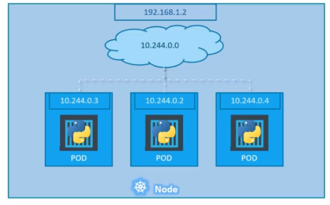

1. Hər container bir podun içinde olur. Daha doğrusu podun içinde hem o container hem de onun helper containerleri olur.

2. Bir nodeda birden çox pod ola biler

3. To create a pod with name nginx using image nginx:

   ```bash
   kubectl run nginx --image=nginx
   ```

4. Yaml faylda, list ve dictionary nedir ve nece yaradılmalıdır ?

   Example:

   ```yaml
   Employee:
     Name: Jacob
     Sex: Male
     Age: 30
     Title: Systems Engineer
     Projects:
       - Automation
       - Support
     Payslips:
       - Month: June
         Wage: 4000
       - Month: July
         Wage: 4500
       - Month: August
         Wage: 4000 
   ```

   

5. What are the fields that we must have in all our config files ?

   - apiVersion: version of the kubernetes api you are using
   - kind: Pod or Service etc.
   - metadata: info about the object
   - spec: add the container informations here

   example pod config:

   ```yaml
   apiVersion: v1
   kind: Pod
   metadata:
     name: myapp-pod
     labels:
       app: myapp
       type: front-end
   spec:
     containers:
       - name: nginx-container
         image: nginx
   ```

6. To create the pod using the config files:

   ```bash
   kubectl create -f pod_config.yml
   ```

7. To see the list of pods available:

   ```bash
   kubectl get pods
   ```

8. Example Pod config file:

   ```yaml
   apiVersion: v1
   kind: Pod
   metadata:
     name: nginx
     labels:
       app: nginx
       tier: frontend
   spec:
     containers:
      - name: nginx
        image: nginx
   ```

9. ```bash
   kubectl describe pod nginx
   
   # will describe the pod nginx
   ```

10. To add an environment variable to a container:

   ```yaml
   apiVersion: v1
   kind: Pod
   metadata:
     name: postgres
     labels:
       tier: db-tier
   spec:
     containers:
       - name: postgres
         image: postgres
         env:
          - name: POSTGRES_PASSWORD
            value: mysecretpassword
   ```

11. What is ReplicationController ?

    - Used to create replicas of the pos in case something happens to the pod

    example config file:

    ```yaml
    apiVersion: v1
    kind: ReplicationController
    metadata:
      name: myapp-rc
      labels:
      	app: myapp
      	type: front-end
    spec:
      template:
      	metadata:
      	 name: postgres
      	 labels:
           app: nginx
    	spec:
      	 containers:
         - name: nginx-container
           image: nginx
      replicas: 3
    ```

12. To create replicas just type:

    ```yaml
    kubectl create -f config.yml
    ```

13. To replace or update replica-set:

    ```yaml
    kubectl replace -f replicatt-definition.yaml
    ```

    ```yaml
    kubectl scale replicaset myapp-replicaset --replicas=6
    ```

    ```bash
    kubectl edit replica-set new-replica-set # name of the replica set
    ```

    

14. Example Replica-set config file:

    ```yaml
    apiVersion: apps/v1
    kind: ReplicaSet
    metadata:
      name: frontend
      labels:
        app: mywebsite
        tier: frontend
    spec:
      replicas: 4
      template:
        metadata:
          name: myapp-pod
          labels:
            app: myapp
        spec:
          containers:
            - name: nginx
              image: nginx
      selector:
        matchLabels:
          app: myapp
    ```

15. To return the replicasets:

    ```bash
    kubectl get replicaset
    ```

16. Deployment:

    - When you create a deployment or in the future update a deployment, a new rollout is triggered and a new deployment revision is created named revision-2

    To see the status of your rollout:

    ```bash
    kubectl rollout status deployment/myapp-deployment
    ```

    To see the rollout history:

    ```bash
    kubectl rollout history deployment/myapp-deployment
    ```

    If you made a mistake in deployment and want to rollback:

    ```bash
    kubectl rollout undo deployment/myapp-deployment
    ```

    

17. A deployment config with Recreate strategy:

    ```yaml
    apiVersion: apps/v1
    kind: Deployment
    metadata:
      name: frontend
      labels:
        app: mywebsite
        tier: frontend
    spec:
      strategy:
        type: Recreate
      replicas: 4
      template:
        metadata:
          name: myapp-pod
          labels:
            app: myapp
        spec:
          containers:
            - name: flaskapp
              image: kodekloud/webapp-color:v2
      selector:
        matchLabels:
          app: myapp
    ```

18. Kubernetes Networking:

    In **Kubernetes**, each node has an IP address. 

    Inside the nod, there is an internal network and each pod has its own internal IP adress.

    

19. Kubernetes Services:

    - They are objects just like Deployment, Replicaset etc.. Are used to connect port to a pod.

    There are 3 types of Services:

    1. NodePort --> service makes an internal pod accessable on a port on the nod
    2.  ClusterIp --> service creates a virtual IP inside the cluster to enable connection between different servers
    3. LoadBalancer --> Distribute load accros the different web servers


NodePort config (definition) file:

```yaml
apiVersion: v1
kind: Service
metadata: 
	name: myapp-service
spec:
	type: NodePort
	ports:
		targetPort: 80
		port: 80
		nodePort: 30008
	selector:
		app: myapp
		type: front-end
```


To create the service:

```bash
kubectl create -f service-definition.yml
```

To show the created services:

```bash
kubectl get services
```


